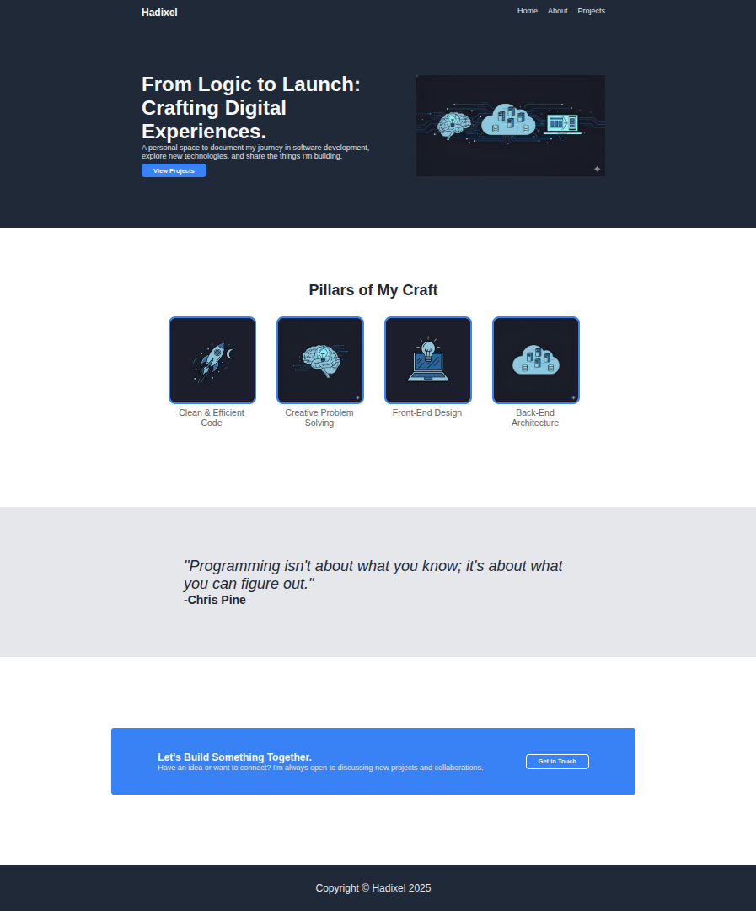

# Landing Page Project
This project is a demonstration of HTML and CSS skills, specifically focusing on Flexbox, as part of The Odin Project's Foundations course. The goal was to build a complete landing page from scratch based on a provided design specification.

## 📝 Project Overview

For this assignment, I created my personal portfolio landing page under the developer name 'Hadixel.' While the layout and structure are based on the examples provided by The Odin Project, the content, images, and theme have been customized to reflect my personal journey into software development.

-   **Live Demo:** [View This Project's pages](https://hadixel.github.io/my-landing-page/)

### 📸 Preview

### ✨ Features

The final webpage is composed of several distinct sections:

-   **Header:** A clean navigation bar with a logo and links.
-   **Hero Section:** An engaging introduction with a main title, a brief description, a call-to-action button, and an image placeholder.
-   **Information Section:** A section showcasing key skills or "Pillars of My Craft," each represented by an image and a short caption.
-   **Quote Section:** An inspiring quote to add a personal touch and break the flow of the page.
-   **Call to Action Section:** A final, prominent call-to-action block to encourage user engagement.
-   **Footer:** A simple footer containing copyright information.

### 🛠️ Technologies Used

-   **HTML5:** Used for structuring the content and elements of the webpage.
-   **CSS3:** Used for styling, layout, and design implementation.
    -   **Flexbox:** Heavily utilized for creating the responsive and organized layout of the different sections.

### 🎯 Learning Objectives

This project was an exercise in consolidating foundational web development skills, including:

-   Implementing complex layouts using Flexbox.
-   Translating a visual design into a functional webpage.
-   Practicing CSS fundamentals, including fonts, colors, margins, padding, and sizing.
-   Writing clean, semantic, and well-structured HTML.

### 🔗 Links

-   **Assignment:** [The Odin Project - Landing Page Assignment](https://www.theodinproject.com/lessons/foundations-landing-page)
-   **Source Code:** [My Repo](https://github.com/Hadixel/my-landing-page)